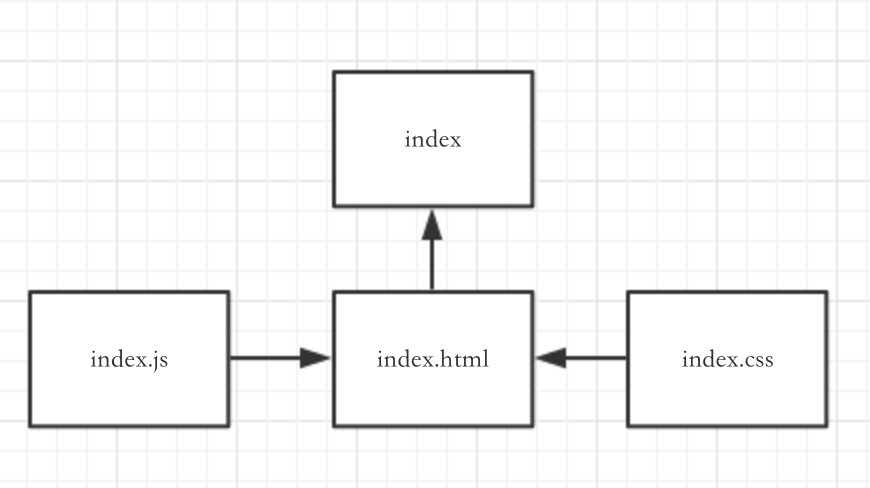

# web-mobile-cli简易教程
[web-mobile-cli](https://github.com/sihai00/web-mobile-cli)：可快速开发移动端h5的脚手架

## 一：脚手架使用
``` bash
# 全局安装
npm install web-mobile-cli -g

# 创建项目目录(name为项目名字)
web-mobile-cli -n name

# 进入项目，运行前请先安装所需依赖
npm install

# 运行以下命令启动服务器 localhost:3000
npm start

# 打包（打包后为**dist目录**，开发为**src**目录）
npm run build
```

> **注意**：运行npm start后如果白屏或者出错，请手动刷新一次，导致的原因可能是browser-sync启动浏览器的时候还没有打包完成

## 二：一个页面构成
一个传统的页面的构成 = html + js + css


所以web-mobile-cli的目录结构为（假如以name为页面名字），都一一对应
- html：html/name.html
- css：sass/page/name.scss
- javascript：js/page/name.js


### 2-1：html
由于集合了[gulp-file-include](https://github.com/coderhaoxin/gulp-file-include)，可将公共的静态html抽离出来重复调用，可根据实际情况决定是否使用，如下简单用法

```html
<!-- a.html -->
<div>a.html</div>
```

```html
<!-- b.html -->
<div>b.html</div>
@@include('./a.html')
```

```html
<!-- 最终渲染 -->
<div>a.html</div>
<div>b.html</div>
```

由于在b.html页面中调用了@@include('./a.html')，所以最终会将a.html的代码片段渲染在b.html中，a.html的代码片段可重复调用，更多用法查看[gulp-file-include](https://github.com/coderhaoxin/gulp-file-include)

### 2-2：sass
main.scss为主入口，在此可定义全局css，通过sass语法@import将其他子页面的sass引入。那么打包后只生成一个main.css文件，减少请求


```scss
/**
 * 适配布局，px转vw
 * h1 {
 *   witdh: pxToVw(20)
 * }
 */
$baseFontSize: 7.5;
@function pxToVw($px) {
  @return $px / $baseFontSize * 1vw;
}

/* 全局样式 */
html, body{
  font-family: "Microsoft YaHei";
  height: 100%;
  margin: 0;
  padding: 0;
}
ul, ol{
  list-style: none;
  margin: 0;
  padding: 0;
}
h1,h2,h3,h4,h5{
  margin: 0;
}

/* 公共组件样式 */
@import "./page/common.scss";

/* 子页面样式 */
@import "./page/index.scss";
```

### 2-3：javascript
面向对象的编程，每个子页面的js都继承至parent类，那么子页面的js可以调用父类parent里的属性和方法（es6语法，如果不熟请自行学习[阮一峰es6](http://es6.ruanyifeng.com/#docs/class)）


```javascript
// parent.js
class parent{
  ...
}

// index.js
class index extends parent{
  ...
}
```

## demo

